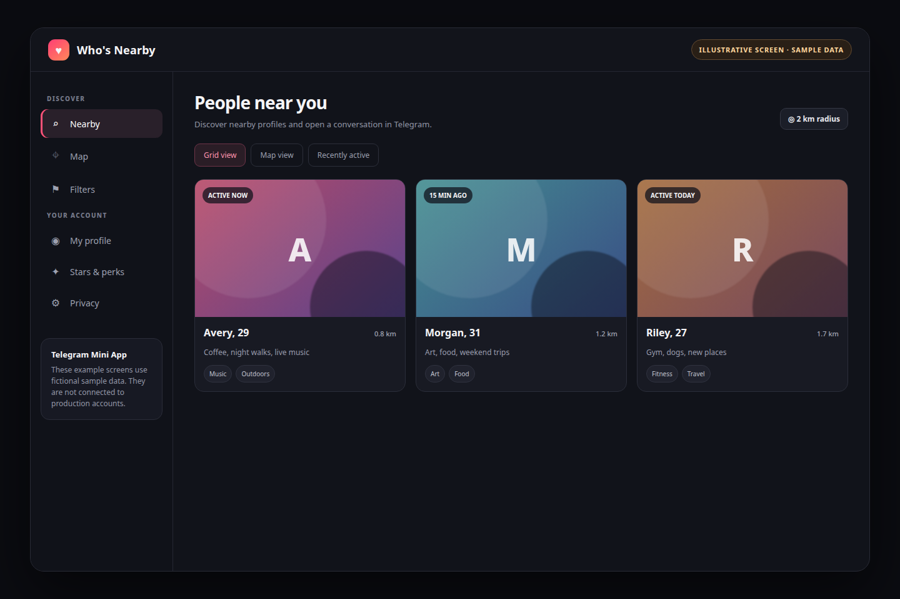
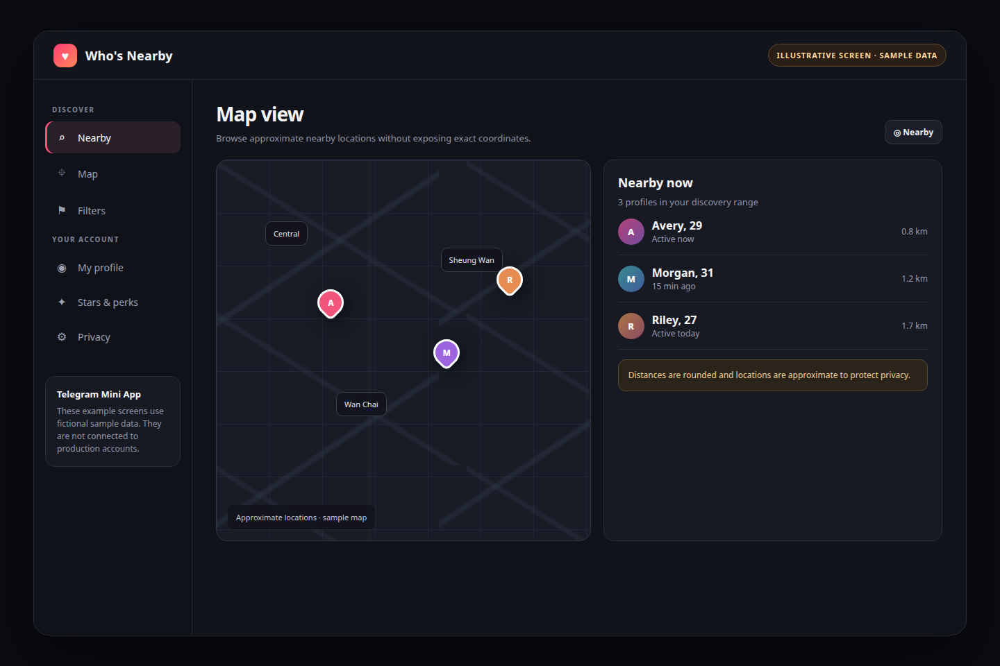
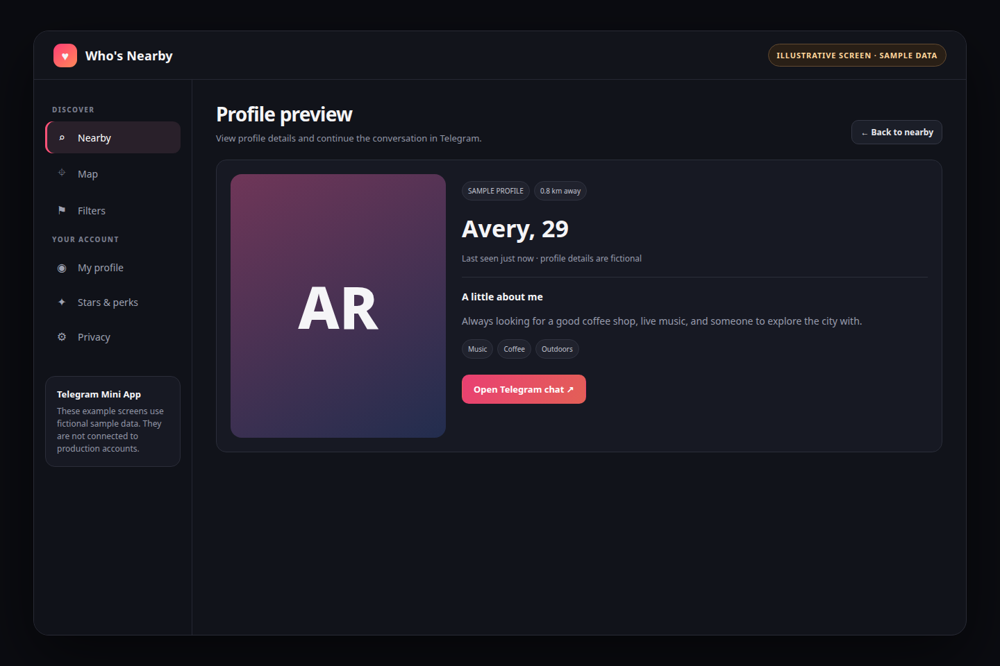
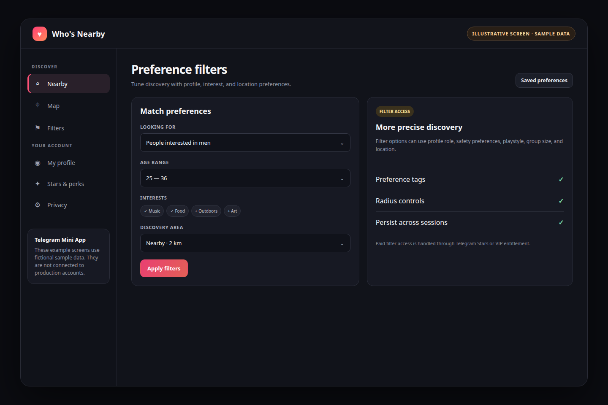
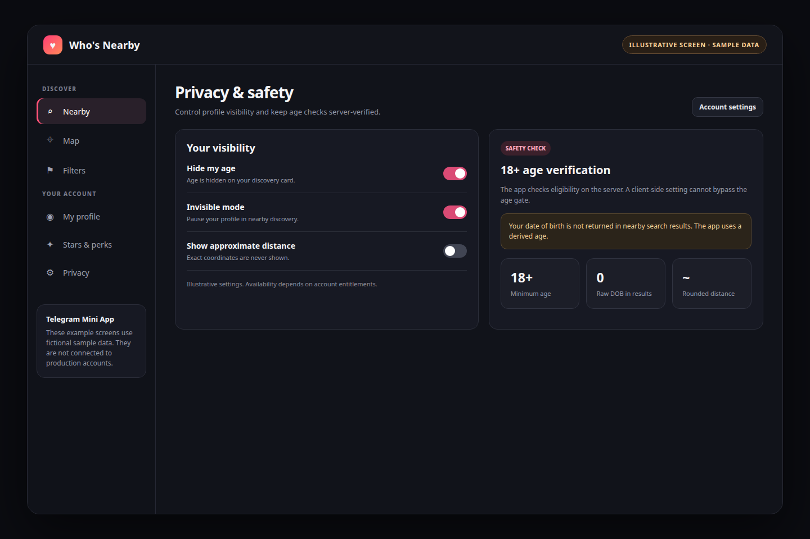
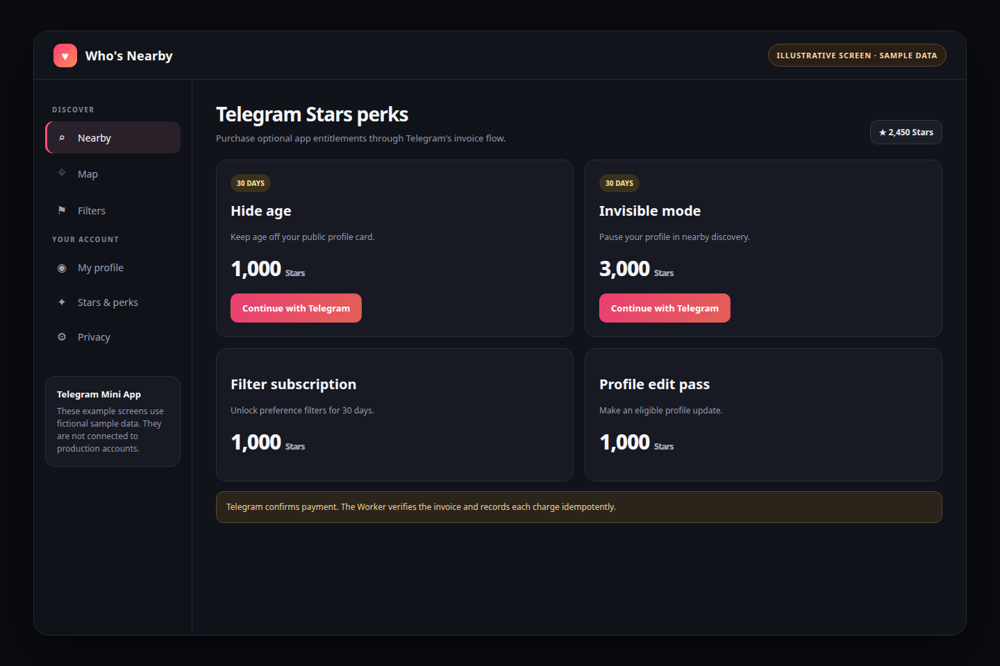
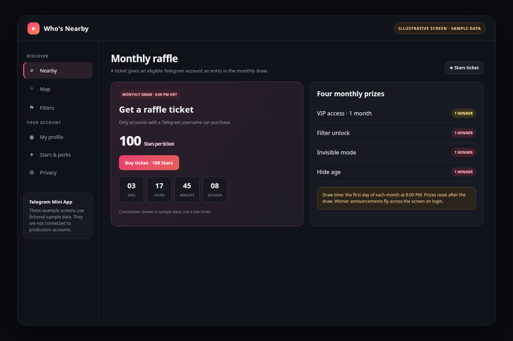
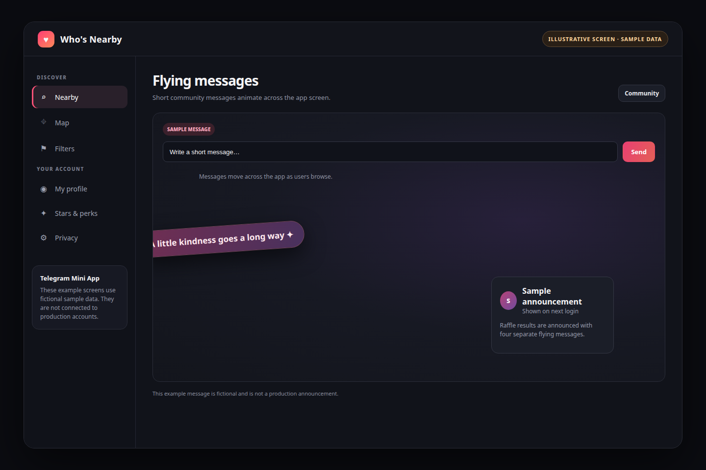
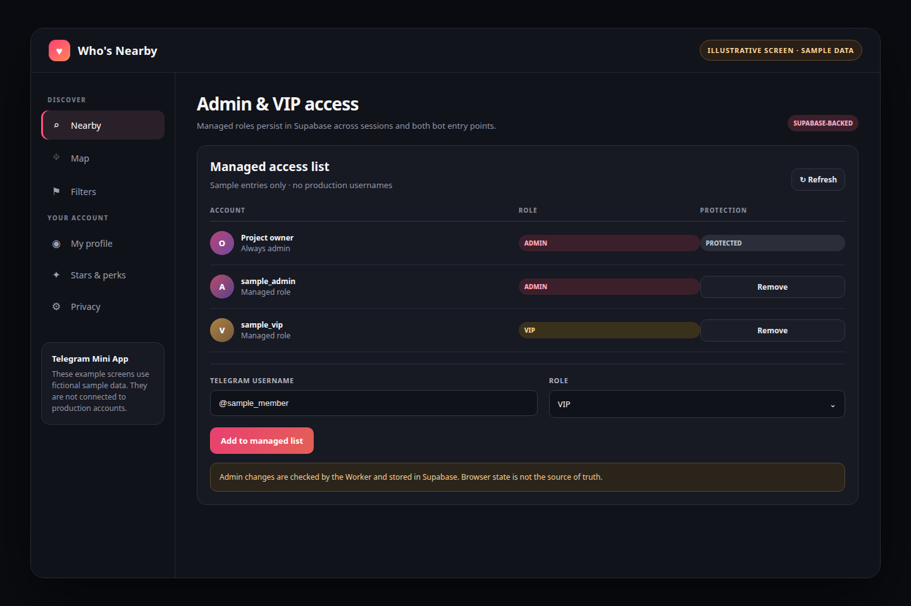

# Who's Nearby feature guide

This guide summarizes the app features and the Supabase-backed admin/VIP update.

> **Screenshot note:** Images below are illustrative UI screens rendered with fictional sample data. They are not captures of signed-in production sessions and contain no real user or admin details.

For a paginated visual version, see [feature-summary.html](feature-summary.html) or the downloadable [PDF](feature-summary.pdf).

## 1. Nearby grid

Browse nearby profiles in a card grid. Cards show derived age, rounded distance, activity, and interests; exact coordinates are not shown.

## 2. Map view

Switch to an approximate map view to browse nearby profiles without exposing exact locations.

## 3. Profile cards and Telegram chat

Review profile details and open a person's Telegram chat from their profile.

## 4. Preference filters

Refine discovery with preferences such as role, safety, playstyle, group size, and location. Paid filter access is available through an eligible subscription or VIP status.

## 5. Privacy and age controls

Eligible accounts can hide age or use invisible mode. The 18+ gate is enforced on the server; nearby results use derived ages and rounded distances.

## 6. Telegram Stars purchases

Optional entitlements use Telegram Stars invoices. The Worker validates payment updates and records each charge idempotently. Check the live app menu for current prices.

## 7. Monthly raffle

Tickets cost 100 Stars and require a Telegram username. The draw is at 8:00 PM Hong Kong time on the first day of each month. Four prizes are drawn: one month of VIP, filter unlock, invisible mode, and hide age. If fewer than four tickets are sold, one player receives VIP; if no tickets are sold, the prizes do not carry over. Winners are announced in four separate flying messages on login.

## 8. Flying messages

Short community messages animate across the app. Raffle results use four separate flying messages on login.

## 9. Admin and VIP management

Managed roles are stored in Supabase `public.app_roles`. The admin menu reads the list from the Worker; authenticated admin changes persist across sessions. The owner remains protected, and VIP does not grant admin access.

See [Admin and VIP roles in Supabase](admin-vip-supabase.md) for storage, migration, and verification details.
